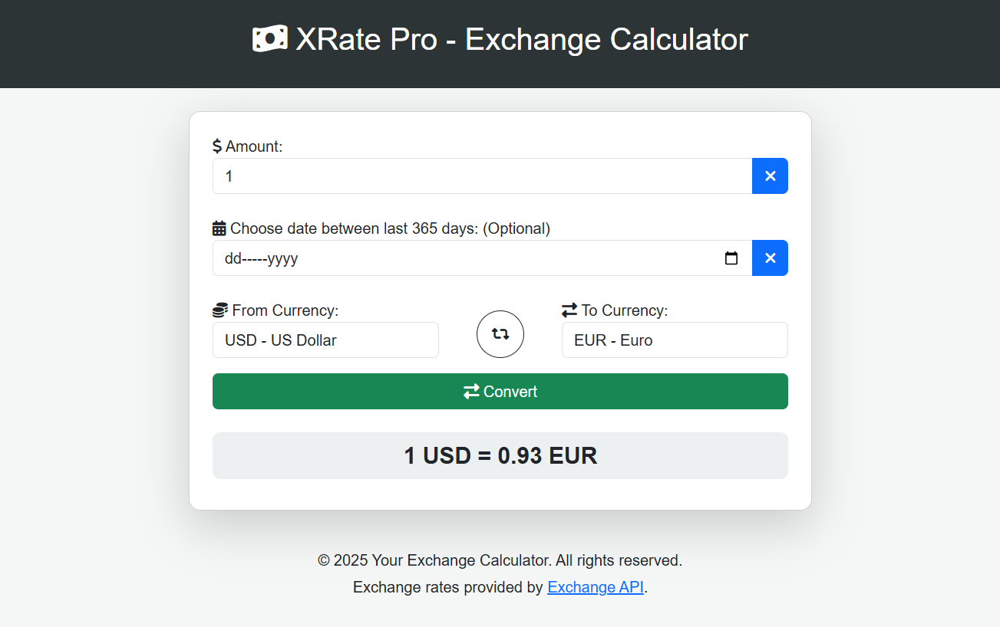

# Currency Exchange Calculator 

A simple and modern currency exchange calculator using **Bootstrap** and the **Exchange API**. It supports real-time conversion, historical exchange rates, and an intuitive UI for easy currency conversion.

## 🚀 Features
- 🌍 **Supports all major currencies**
- 📆 **Historical exchange rates (up to 365 days)**
- 🔄 **Swap currencies instantly**
- 📊 **Accurate conversion using Exchange API**
- 🎨 **Modern and mobile-friendly UI with Bootstrap**
- ⚡ **Fast and lightweight**

## 📷 Screenshots

  

## 🔗 API Source
This project uses the [Exchange API](https://github.com/fawazahmed0/currency-api) for real-time and historical exchange rates.

## ⚡ Usage
- Enter the amount.
- Select base and target currencies.
- Choose a date (optional for historical rates).
- Click "Convert" to get the latest exchange rate.

## 📝 License
This project is licensed under the MIT License. See the [LICENSE](LICENSE) file for details.

⭐ Enjoy using the app? Give this repo a star! 🌟